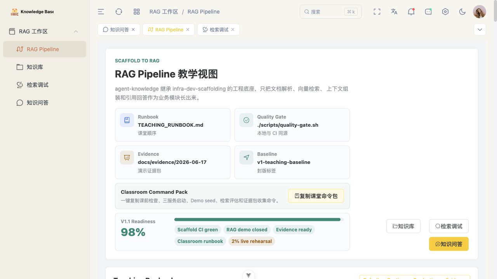
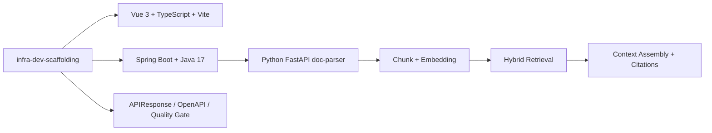
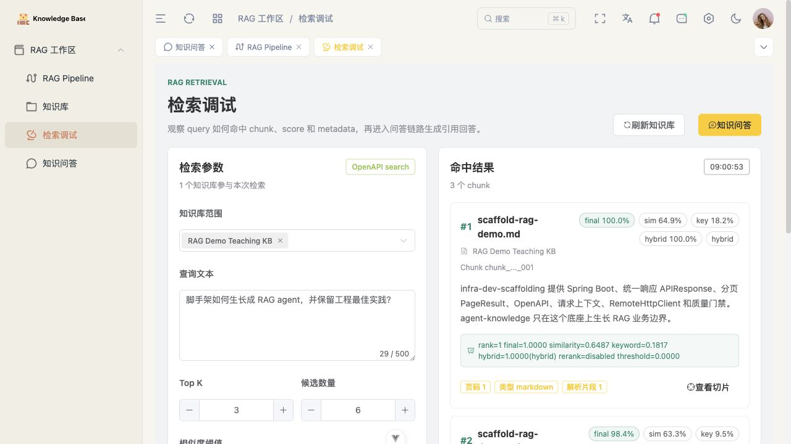
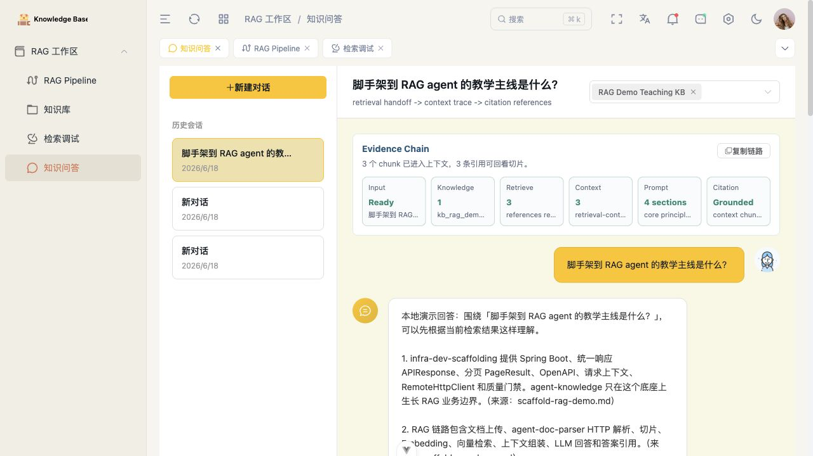

# Agent Knowledge

基于 `infra-dev-scaffolding` 生长出来的 RAG 智能知识库，也是一个高级 agent 教学示例。

学习这个项目时，重点看 RAG 设计；工程底座、技术栈、API 习惯、质量门禁和前后端约定都沿用脚手架。

<p align="center">
  
</p>

## 一句话定位

V1.1 teaching baseline 已完成：它不是生产级 RAG 平台，而是一个能本地跑通、能教学、能展示完整业务背景的 RAG agent。

## 从脚手架长出来



Java 后端负责知识库、文档状态、检索、聊天和 RAG 编排；Python `doc-parser` 保持独立服务，只通过 HTTP contract 被调用。

## Demo 画面

<table>
  <tr>
    <td width="50%">
      
    </td>
    <td width="50%">
      
    </td>
  </tr>
  <tr>
    <td align="center">检索调试：query、rank、source、scoreExplanation</td>
    <td align="center">知识问答：context trace、prompt sections、citation cards</td>
  </tr>
</table>

## 已完成什么

- 脚手架继承：Vue 3.5 + TypeScript + Vite 7，Spring Boot 3.4.5 + Java 17，统一响应、分页、OpenAPI、请求上下文和 CI 质量门禁。
- RAG 主链路：上传解析、切片、Embedding、混合检索、上下文组装、local-demo 回答和答案引用。
- 教学入口：Pipeline、Knowledge、Retrieval、Chat 四个页面能讲清楚证据链。
- 证据包：`docs/evidence/2026-06-18/` 已沉淀运行输出、runtime JSON、citation evidence 和截图。
- 生产边界：pgvector、BM25、Elasticsearch、remote rerank、async doc-parser 都作为后续替换轴保留。

## 本地启动

```bash
# 1. doc-parser: http://localhost:9001
(cd doc-parser && python -m uvicorn kparser.app:app --host 0.0.0.0 --port 9001)

# 2. backend: http://localhost:10001
(cd backend && mvn spring-boot:run)

# 3. frontend: http://localhost:20001
(cd frontend && pnpm install && pnpm dev)
```

打开：`http://localhost:20001/#/kb/pipeline`

## 课堂验证

```bash
./scripts/check-teaching-handoff.sh
./scripts/quality-gate.sh
./scripts/probe-rag-demo-runtime.sh
./scripts/probe-rag-ingestion-runtime.sh
```

刷新证据包：

```bash
./scripts/collect-demo-evidence.sh --date 2026-06-18 --force --include-doc-parser-live
```

## 项目结构

```text
backend/           Spring Boot 后端：知识库、文档、检索、聊天和 RAG orchestration
frontend/          Vue 前端：知识库、文档、检索、聊天和 pipeline 教学页
doc-parser/        Python FastAPI 文档解析服务
contracts/         平台契约、服务边界、doc-parser 和 retrieval adapter 契约
project_document/  设计、边界、路线图、状态和验证记录
docs/evidence/     可复现演示证据包
```

## 继续阅读

- [project_document/PROJECT_CONSTRAINTS.md](./project_document/PROJECT_CONSTRAINTS.md)
- [project_document/NEW_MODULE_GUIDE.md](./project_document/NEW_MODULE_GUIDE.md)
- [project_document/SCAFFOLD_ADOPTION_PROMPT.md](./project_document/SCAFFOLD_ADOPTION_PROMPT.md)
- [project_document/UI_DESIGN_GUIDE.md](./project_document/UI_DESIGN_GUIDE.md)
- [project_document/DEMO_EVIDENCE.md](./project_document/DEMO_EVIDENCE.md)
- [project_document/TEACHING_RUNBOOK.md](./project_document/TEACHING_RUNBOOK.md)
- [project_document/FINAL_READINESS_AUDIT.md](./project_document/FINAL_READINESS_AUDIT.md)
- [project_document/SCAFFOLD_TO_RAG_AGENT_GUIDE.md](./project_document/SCAFFOLD_TO_RAG_AGENT_GUIDE.md)
- [contracts/scaffold-stack-contract.json](./contracts/scaffold-stack-contract.json)
- [contracts/doc-parser-contract.json](./contracts/doc-parser-contract.json)

## License

MIT
