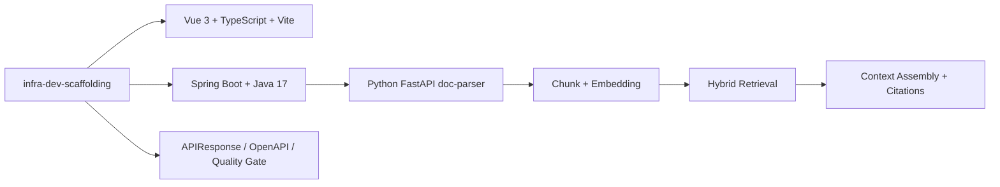

# Agent Knowledge

基于 `infra-dev-scaffolding` 生长出来的 RAG 智能知识库：文档上传、Python doc-parser、切片、Embedding、检索、上下文组装、答案引用，一条链路跑通。

<p align="center">
  
</p>

## 进度

V1.1 teaching baseline 已完成。这个项目是教学样板，不是生产平台；技术栈、工程习惯、API 约定和质量门禁都来自脚手架，学习重点放在 RAG 设计。

## 架构



Java 后端负责知识库、文档状态、检索、聊天和 RAG 编排；Python `doc-parser` 是独立 FastAPI 服务，只通过 HTTP contract 交互。

## Demo

<table>
  <tr>
    <td width="50%">
      
    </td>
    <td width="50%">
      
    </td>
  </tr>
  <tr>
    <td align="center">检索调试：query、rank、source、scoreExplanation</td>
    <td align="center">知识问答：context trace、prompt sections、citation cards</td>
  </tr>
</table>

## 能力

- 脚手架底座：Vue 3.5 + TypeScript + Vite 7，Spring Boot 3.4.5 + Java 17，统一响应、分页、OpenAPI、请求上下文和 CI。
- RAG 主链路：上传解析、切片、Embedding、混合检索、上下文组装、local-demo 回答和引用。
- 替换边界：pgvector、BM25、Elasticsearch、remote rerank、async doc-parser。
- 证据包：`docs/evidence/2026-06-18/` 保存运行输出、runtime JSON、citation evidence 和截图。

## 本地启动

```bash
# 1. doc-parser: http://localhost:9001
(cd doc-parser && python -m uvicorn kparser.app:app --host 0.0.0.0 --port 9001)

# 2. backend: http://localhost:10001
(cd backend && mvn spring-boot:run)

# 3. frontend: http://localhost:20001
(cd frontend && pnpm install && pnpm dev)
```

打开：`http://localhost:20001/#/kb/pipeline`

## 验证

```bash
./scripts/quality-gate.sh
./scripts/check-teaching-handoff.sh
./scripts/probe-rag-demo-runtime.sh
./scripts/probe-rag-ingestion-runtime.sh
./scripts/collect-demo-evidence.sh --date 2026-06-18 --force --include-doc-parser-live
```

## 结构

```text
backend/           Spring Boot：知识库、文档、检索、聊天、RAG orchestration
frontend/          Vue：Pipeline、Knowledge、Retrieval、Chat
doc-parser/        Python FastAPI 文档解析服务
contracts/         平台、doc-parser、retrieval adapter 契约
project_document/  设计、边界、路线图、验证记录
docs/evidence/     可复现演示证据包
```

## 文档

| 入口 | 用途 |
| --- | --- |
| [project_document/PROJECT_CONSTRAINTS.md](./project_document/PROJECT_CONSTRAINTS.md) | 工程约束 |
| [project_document/NEW_MODULE_GUIDE.md](./project_document/NEW_MODULE_GUIDE.md) | 新模块规范 |
| [project_document/SCAFFOLD_ADOPTION_PROMPT.md](./project_document/SCAFFOLD_ADOPTION_PROMPT.md) | 脚手架采纳提示词 |
| [project_document/UI_DESIGN_GUIDE.md](./project_document/UI_DESIGN_GUIDE.md) | UI 约束 |
| [project_document/DEMO_EVIDENCE.md](./project_document/DEMO_EVIDENCE.md) | 演示证据 |
| [project_document/TEACHING_RUNBOOK.md](./project_document/TEACHING_RUNBOOK.md) | 课堂流程 |
| [project_document/FINAL_READINESS_AUDIT.md](./project_document/FINAL_READINESS_AUDIT.md) | 最终验收 |
| [project_document/SCAFFOLD_TO_RAG_AGENT_GUIDE.md](./project_document/SCAFFOLD_TO_RAG_AGENT_GUIDE.md) | 从脚手架到 RAG Agent |
| [contracts/scaffold-stack-contract.json](./contracts/scaffold-stack-contract.json) | 技术栈契约 |
| [contracts/doc-parser-contract.json](./contracts/doc-parser-contract.json) | doc-parser 契约 |

## License

MIT
