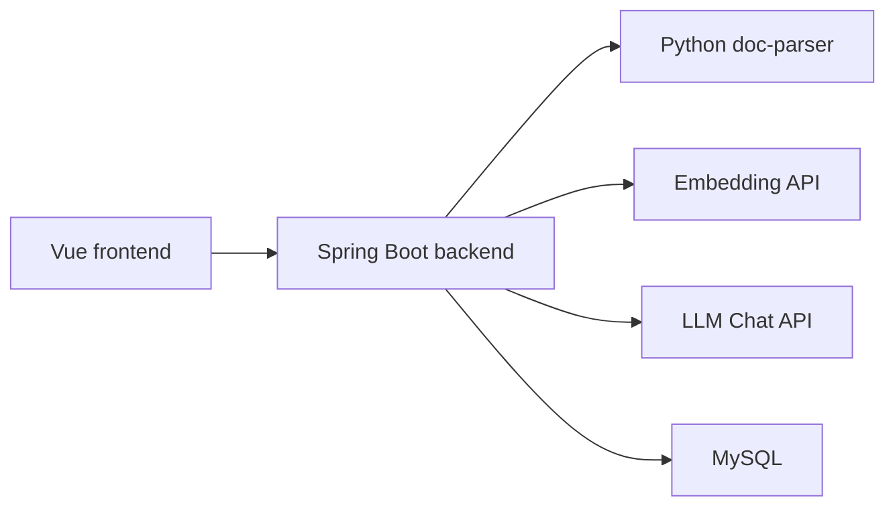

# Architecture Evolution

## 当前架构

运行 API 边界以 `contracts/service-boundaries.json` 为事实来源，并通过 `scripts/check-service-boundaries.js` 校验后端 `ApiConstants`、Controller base path 和前端 `ApiPaths` 的一致性。请求上下文、日志 MDC 和远程透传由 `scripts/check-backend-context-contract.js` 守住，异步任务上下文由 `scripts/check-async-context-contract.js` 守住，确保 RAG 链路排查时可以按 requestId / traceId 串联前端、Java 后端和 Python doc-parser 调用。

## V1 架构判断

- 使用 Spring Boot 承载知识库、文档、检索和聊天业务。
- 使用 Python FastAPI 承载文档解析能力。
- 使用 MySQL 保存元数据、文档、Chunk、会话和消息。
- 当前向量能力以教学/演示实现优先，后续可替换为 Milvus、pgvector 或托管向量库。

## 演进方向

### Ingestion 任务化

同步上传适合 V1 演示，但生产场景应改成任务模型：

上传 -> 创建解析任务 -> 查询进度 -> 保存解析结果 -> Chunk -> Embedding -> 完成。

### Retrieval 独立化

当前 retrieval 在同一 Java 后端中。V2/V3 可按需要抽出独立服务，但必须保持请求/响应契约稳定。

### Provider 可插拔

Embedding、LLM、doc-parser、向量库都应通过配置和 adapter 替换，不把某个供应商写死到业务层。

### 引用增强

引用不应只停留在 docName + chunk content。V2/V3 需要利用 doc-parser metadata 支持页码、表格、图片和坐标级引用。
